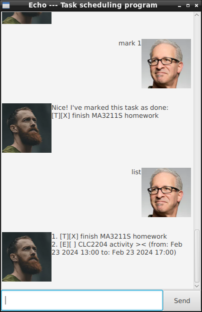

# Echo User Guide



This is CS2103T's iP project, which contains basic features to manage pending tasks, deadlines and events.

## Running program

To run the program, download the JAR file from GitHub at [https://github.com/E0735389/ip/releases](https://github.com/E0735389/ip/releases), then run with the following command:

```bash
java -jar echo.jar
```

Once you open the program, you should be greeted with a GUI window with a prompt.
Type in commands in order to perform various tasks.

## Adding to-do tasks

You can type in `todo ⟨task description⟩` in order to add a to-do task.

Example: `todo homework`

Then, the program should respond with, for example:

```
Got it. I've added this task:
[T][ ] homework
Now you have 1 task in the list.
```

A to-do task consists of only a task description.
The meaning of the `[T][ ]` part in the output will be explained below,
in the
["Marking a task as done" section](#marking-a-task-as-done)
and the
["Adding deadline tasks" section](#adding-deadline-tasks).

## Listing the current tasks

Typing the command `list` should list all the tasks. For example, the output could be:

```
1. [T][ ] homework
```

## Marking a task as done

A task can be marked as done with the `mark` command.
In the situation above, typing `mark 1` will output:
```
Nice! I've marked this task as done:
[T][X] homework
```
As we can see, the second box shows whether the task is done. `[X]` means the task is done, and `[ ]` means it isn't.

## Adding deadline tasks

Apart from to-do task, we can also add other types of tasks.
A deadline task is one that must be done before a specific time.
For example, you can type
`deadline finish CS2103T iP /by 2024-02-23 23:59`
in order to add a deadline with description "finish CS2103T iP"
and due at "2024-02-23 23:59".

The program should respond with:
```
Got it. I've added this task:
[D][ ] finish CS2103T iP (by: Feb 23 2024 23:59)
Now you have 2 tasks in the list.
```
This time, the first box contains `[D]` instead of `[T]`: D stands for deadlines, T stands for to-do.

## Adding event tasks

An event task is one that occurs at a specific time.
For example, you can type
`event undergraduate math seminar /from 2024-02-21 14:00 /to 2024-02-21 18:00`
in order to add an event with description "undergraduate math seminar"
that happens between 14:00 and 18:00 on 2024-02-21.

For events, the first box would contain `[E]`.

## Deleting a task

You can delete a task by typing `delete ⟨task number⟩`.
For example, typing `delete 2` will delete the second task in the list.

## Finding tasks by keyword

You can find tasks by typing `find ⟨keyword⟩`.
For example, typing `find CS2103T` will find all tasks with "CS2103T" in their descriptions.

## Exiting the program

You can exit the program by typing `bye`, or by the same method as used to exit a normal GUI application.

## Saving the data

The program saves the data in the hard disk automatically after any command that changes the data. There is no need to save manually.

## Command summary

- Add to-do task: `todo ⟨task description⟩`
- List tasks: `list`
- Mark a task as done: `mark ⟨task number⟩`
- Add deadline task: `deadline ⟨task description⟩ /by ⟨due time⟩`
- Add event task: `event ⟨task description⟩ /from ⟨start time⟩ /to ⟨end time⟩`
- Delete a task: `delete ⟨task number⟩`
- Find reminders by keyword: `find ⟨keyword⟩`
- Exit the program: `bye`

## Acknowledgement

- Some AI assistance was used to fill in repetitive/boilerplate of the code.
- The images, and much of the GUI code, are taken from [JavaFX tutorial part 3 on SE-EDU](https://se-education.org/guides/tutorials/javaFxPart3.html).
